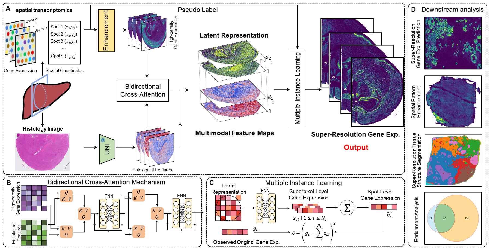

# HISTEX
## Introduction
The groundbreaking development of spatial transcriptomics (ST) enables researchers to map gene expression across tissues with spatial precision. However, current next-generation sequencing methods, which theoretically cover the entire transcriptome, face limitations in resolving spatial gene expression at high resolution. The recently introduced Visium HD technology offers a balance between sequencing depth and spatial resolution, but its complex sample preparation and high cost limit its widespread adoption. To address these challenges, we introduce HISTEX, a multimodal fusion approach that leverages a bidirectional cross-attention mechanism and a general-purpose foundation model. HISTEX integrates spot-based ST data with histology images to predict super-resolution (SR) spatial gene expression. Experimental evaluations demonstrate that HISTEX outperforms state-of-the-art methods in accurately predicting SR gene expression across diverse datasets from multiple platforms. Moreover, experimental validation underscores HISTEX’s potential to generate new biological insights. It enhances spatial patterns, enriches biologically significant pathways, and facilitates the SR annotation of tissue structures. These findings highlight HISTEX as a powerful tool for advancing ST research.



## Requirements
All experiments were conducted on an NVIDIA RTX 3090 GPU. Before running HISTEX, you need to create a conda environment and install the required packages:
```shell
conda create -n HISTEX python==3.11.5
conda activate HISTEX
pip install -r requirements.txt
```
## Data
The Xenium human breast cancer datasets: [https://www.10xgenomics.com/products/xenium-in-situ/preview-dataset-human-breast](https://www.10xgenomics.com/products/xenium-in-situ/preview-dataset-human-breast).

The Visium HD human breast cancer: [https://www.10xgenomics.com/datasets/visium-hd-cytassist-gene-expression-human-breast-cancer-fresh-frozen](https://www.10xgenomics.com/datasets/visium-hd-cytassist-gene-expression-human-breast-cancer-fresh-frozen).

The Visium HD mouse brain: [https://www.10xgenomics.com/datasets/visium-hd-cytassist-gene-expression-mouse-brain-fresh-frozen](https://www.10xgenomics.com/datasets/visium-hd-cytassist-gene-expression-mouse-brain-fresh-frozen).

The HER2-positive breast cancer datasets: [https://github.com/almaan/her2st](https://github.com/almaan/her2st).
